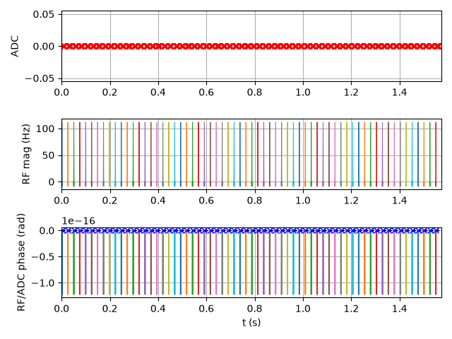
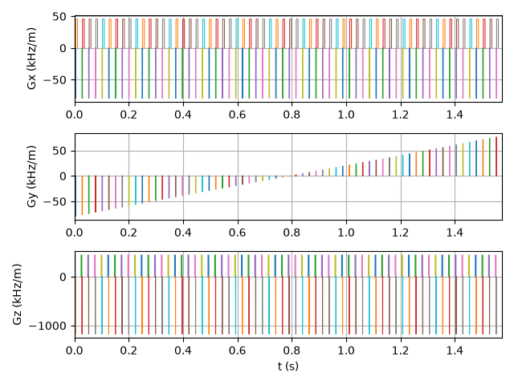
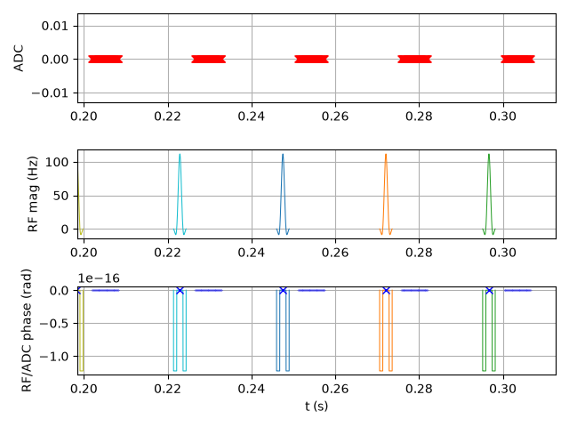
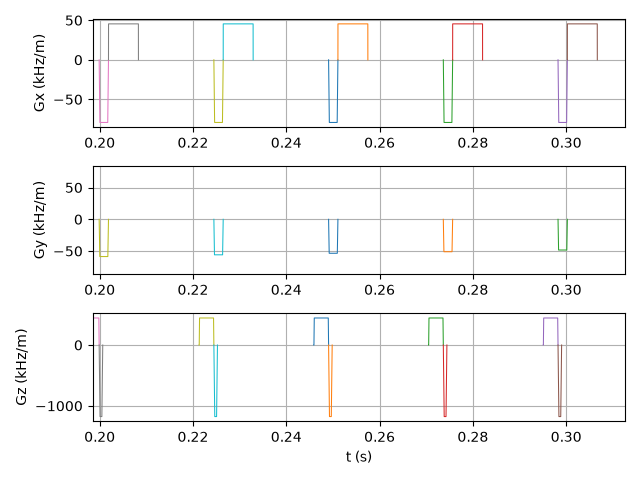

# MRI Pulse Sequence Development — PyPulseq

**Author:** Kuljit Singh | MS Medical Systems Engineering, Otto Von Guericke University, Magdeburg  


---

## Overview

This project demonstrates the design, validation, and simulation of MRI pulse sequences using **PyPulseq** — an open-source Python framework for MRI sequence development. The sequences export universal `.seq` files compatible with real MRI scanner hardware via the C++ Pulseq reader.

The project covers the complete MRI signal chain:

```
Pulse Sequence Design (PyPulseq)
        ↓
K-space Trajectory (uniform sampling validation)
        ↓
Hardware Validation (gradient limits, slew rate, timing)
        ↓
K-space Simulation (forward FFT of Shepp-Logan phantom)
        ↓
Image Reconstruction (2D inverse FFT)
        ↓
Visual Confirmation (reconstructed image matches ground truth)
```

---

## Sequences Implemented

### Gradient Echo (GRE) Sequence
A complete 2D gradient echo pulse sequence with:
- Sinc-shaped RF pulse with Hamming apodization
- Slice selection gradient + rephaser (Gz)
- Phase encoding gradient stepping through 64 k-space lines (Gy)
- Trapezoidal readout gradient with ADC acquisition (Gx)
- Correct pre-phaser to reach k-space edge before readout

**Sequence Parameters:**

| Parameter | Value |
|---|---|
| Field of View | 220 mm |
| Matrix Size | 64 × 64 |
| Slice Thickness | 3 mm |
| Flip Angle | 30° |
| Repetition Time (TR) | 20 ms |
| Echo Time (TE) | 5 ms |
| Total Scan Time | ~1574 ms |
| Max Gradient Strength | 28 mT/m |
| Max Slew Rate | 150 T/m/s |

---

## Results

### Sequence Timing Diagram — Full Sequence (64 TRs)

| RF / ADC | Gradients |
|---|---|
|  |  |

The full sequence timing confirms:
- **RF pulse** fires 64 times — once per TR ✅
- **Gz** slice selection gradient fires with every RF pulse ✅
- **Gy** phase encode gradient steps through 64 different values — one per k-space line ✅
- **Gx** readout gradient consistent every TR ✅
- **ADC** sampling window present every TR ✅

---

### Single TR Detail — Zoomed View

| RF / ADC Zoomed | Gradients Zoomed |
|---|---|
|  |  |

The zoomed region (highlighted in the full sequence diagram) confirms correct intra-TR structure:
- RF sinc pulse fires first with simultaneous Gz slice selection
- Gz rephaser plays immediately after RF pulse
- Gx pre-phaser moves to left edge of k-space
- Gy phase encode selects the correct k-space row
- Gx readout gradient plays while ADC samples — ADC delayed to gradient flat top
- TR timing respected throughout

---


### Hardware Validation

```
Validation PASSED — sequence is physically correct!
All gradient limits, slew rates and timing checks passed.
```

All gradient amplitudes confirmed within 28 mT/m hardware limit.  
All slew rates confirmed within 150 T/m/s hardware limit.  
ADC timing confirmed aligned to gradient flat top — no sampling during ramps.

---

### K-space Trajectory


- **Left:** Full trajectory showing the sequence path through k-space (blue) and ADC sample positions (red)
- **Right:** Uniform 64×64 grid of sampled k-space points — confirms correct Cartesian sampling pattern

---

### Image Reconstruction from Simulated K-space


- **Left:** Original Shepp-Logan phantom (ground truth)
- **Middle:** Simulated k-space (log magnitude) — bright centre = low spatial frequencies (contrast), dark edges = high spatial frequencies (fine detail)
- **Right:** Reconstructed MRI image via 2D inverse FFT — matches ground truth confirming correct k-space sampling

---

## Technical Stack

| Tool | Purpose |
|---|---|
| Python 3.13 | Core programming language |
| PyPulseq 1.5.0 | MRI pulse sequence design |
| NumPy | Numerical computation, FFT |
| Matplotlib | Timing diagrams, trajectory plots |

---

## Pulseq Ecosystem

This project uses **PyPulseq** (Python port) which exports universal `.seq` files compatible with the [pulseq-admin/pulseq](https://github.com/pulseq-admin/pulseq) standard:

```
PyPulseq (Python) — sequence design
        ↓
.seq file — universal format (pulseq standard)
        ↓
C++ reader on scanner hardware — execution
```

The `.seq` file generated (`gre_sequence.seq`) can be loaded directly onto any Pulseq-compatible MRI scanner including low-field systems.

---

## Project Structure

```
PulseSeq/
├── gre_sequence.py          # GRE pulse sequence design + timing diagram
├── gre_analysis.py          # K-space trajectory, validation, reconstruction
├── gre_sequence.seq         # Scanner-ready sequence file (Pulseq format)
├── gre_timing_full.png      # Full sequence timing diagram (64 TRs)
├── gre_gradients_full.png   # Full gradient waveforms (64 TRs)
├── gre_timing_zoomed.png    # Single TR timing detail
├── gre_gradients_zoomed.png # Single TR gradient detail
├── kspace_trajectory.png    # K-space trajectory plot
├── gre_reconstruction1.png  # Phantom simulation and reconstruction
└── README.md
```

---

## Key Concepts Demonstrated

- **RF Pulse Design** — Sinc pulse with Hamming apodization and time-bandwidth product control
- **Gradient Design** — Trapezoidal gradients for slice selection, phase encoding, frequency encoding
- **K-space Sampling** — Uniform Cartesian sampling with correct pre-phaser placement
- **Sequence Timing** — TR/TE control, ADC delay alignment to gradient flat top
- **Hardware Validation** — Gradient amplitude and slew rate limit checking
- **Image Reconstruction** — 2D FFT-based reconstruction from simulated k-space data
- **.seq File Export** — Universal scanner-ready format compatible with C++ Pulseq reader

---

## Relevance to Low-Field MRI

While this sequence was designed with standard parameters, the same principles apply directly to low-field MRI systems:

- Larmor frequency scales linearly with B0 → RF pulse centre frequency adjusts accordingly
- Lower SNR at low field → pulse sequence optimisation becomes more critical
- PyPulseq `.seq` files are field-strength agnostic — the same format works across field strengths
- Gradient and timing constraints can be directly adjusted in the `pp.Opts()` system definition

---

## Related Portfolio Projects

| Project | Description | Tech | Link |
|---|---|---|---|
| 🤖 Deep Learning Classifier | Neural network for MRI tissue classification (97% accuracy) | TensorFlow, Keras, Python | [GitHub](https://github.com/kuljit-medtech/MRI-DeepLearning) |
| 📡 3T MRI RF Coil Simulation | Electromagnetic simulation of 3T surface coil — S11 = -34.27dB, B1+/B1- field maps, SAR10g analysis, current density (95 A/m) | CST Studio Suite · MATLAB · LaTeX | [GitHub](https://github.com/kuljit-medtech/MRI-RF-Coil-Simulation-3T) |
| 🏥 hazen Contribution | Bug fix PR to NHS MRI QA tool | Python, Git | [PR #516](https://github.com/GSTT-CSC/hazen/pull/516) |
| 🌐 MRI Web App | Live interactive MRI brain analysis tool | Python, Streamlit | [GitHub](https://github.com/kuljit-medtech/MRI-webapp) · [🌍 Live Demo](https://kuljit-medtech-mri-webapp.streamlit.app) |
| 🔬 MRI Segmentation | Automated brain tissue segmentation | Python, Scikit-learn, K-means | [GitHub](https://github.com/kuljit-medtech/mri-segmentation) |
| 📊 MRI Analysis | Automated clinical PDF report generation | Python, Pandas, ReportLab | [GitHub](https://github.com/kuljit-medtech/mri-analysis) |
| 🧠 MRI Brain Viewer | Interactive MRI brain scan visualiser | Python, NiBabel, Matplotlib | [GitHub](https://github.com/kuljit-medtech/mri-brain-viewer) |

---

## Author

**Kuljit Singh**  
MS Medical Systems Engineering — Otto Von Guericke University, Magdeburg, Germany  
BE Electrical Engineering — Baba Banda Singh Bahadur Engineering College, India

📧 skuljit2005@gmail.com  
🔗 [LinkedIn](https://www.linkedin.com/in/kuljit-singh-021252197/)  
🐙 [GitHub](https://github.com/kuljit-medtech)  
🌐 [Live MRI Web App](https://kuljit-medtech-mri-webapp.streamlit.app)
