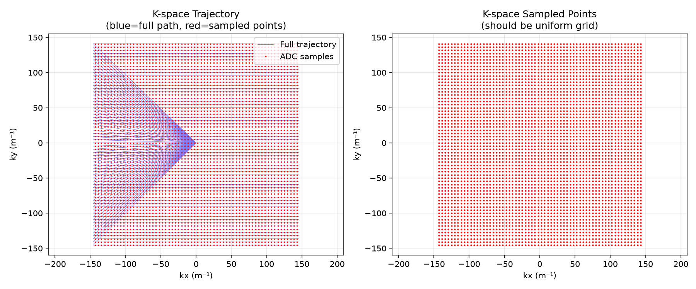
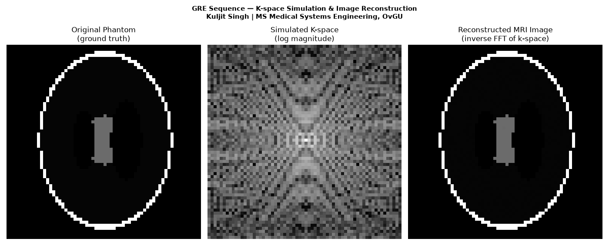

# MRI Pulse Sequence Development — PyPulseq

**Author:** Kuljit Singh | MS Medical Systems Engineering, Otto Von Guericke University, Magdeburg  


---

## Overview

This project demonstrates the design, validation, and simulation of MRI pulse sequences using **PyPulseq** — an open-source Python framework for MRI sequence development. The sequences export universal `.seq` files compatible with real MRI scanner hardware via the C++ Pulseq reader.

The project covers the complete MRI signal chain:

```
Pulse Sequence Design (PyPulseq)
        ↓
K-space Trajectory (uniform sampling validation)
        ↓
Hardware Validation (gradient limits, slew rate, timing)
        ↓
K-space Simulation (forward FFT of Shepp-Logan phantom)
        ↓
Image Reconstruction (2D inverse FFT)
        ↓
Visual Confirmation (reconstructed image matches ground truth)
```

---

## Sequences Implemented

### 1. Gradient Echo (GRE) Sequence
A complete 2D gradient echo pulse sequence with:
- Sinc-shaped RF pulse with Hamming apodization
- Slice selection gradient + rephaser (Gz)
- Phase encoding gradient stepping through 64 k-space lines (Gy)
- Trapezoidal readout gradient with ADC acquisition (Gx)
- Correct pre-phaser to reach k-space edge before readout

**Sequence Parameters:**

| Parameter | Value |
|---|---|
| Field of View | 220 mm |
| Matrix Size | 64 × 64 |
| Slice Thickness | 3 mm |
| Flip Angle | 30° |
| Repetition Time (TR) | 20 ms |
| Echo Time (TE) | 5 ms |
| Total Scan Time | ~1574 ms |

---

## Results

### K-space Trajectory


- **Left:** Full trajectory showing the sequence path through k-space (blue) and ADC sample positions (red)
- **Right:** Uniform 64×64 grid of sampled k-space points confirming correct sequence design

### Image Reconstruction


- **Left:** Original Shepp-Logan phantom (ground truth)
- **Middle:** Simulated k-space (log magnitude) — bright centre = low spatial frequencies (contrast), dark edges = high spatial frequencies (detail)
- **Right:** Reconstructed MRI image via 2D inverse FFT — matches ground truth confirming correct k-space sampling

### Sequence Validation
```
Validation PASSED — sequence is physically correct!
All gradient limits, slew rates and timing checks passed.
```

---

## Technical Stack

| Tool | Purpose |
|---|---|
| Python 3.13 | Core programming language |
| PyPulseq 1.5.0 | MRI pulse sequence design |
| NumPy | Numerical computation, FFT |
| Matplotlib | Timing diagrams, trajectory plots |

---

## Pulseq Ecosystem

This project uses **PyPulseq** (Python port) which exports universal `.seq` files compatible with the [pulseq-admin/pulseq](https://github.com/pulseq-admin/pulseq) standard:

```
PyPulseq (Python) — sequence design
        ↓
.seq file — universal format
        ↓
C++ reader on scanner hardware — execution
```

The `.seq` file generated (`gre_sequence.seq`) can be loaded directly onto any Pulseq-compatible MRI scanner.

---

## Project Structure

```
PulseSeq/
├── gre_sequence.py       # GRE pulse sequence design + timing diagram
├── gre_analysis.py       # K-space trajectory, validation, reconstruction
├── gre_sequence.seq      # Scanner-ready sequence file (Pulseq format)
├── kspace_trajectory.png # K-space trajectory plot
├── gre_reconstruction1.png# Phantom simulation and reconstruction
└── README.md
```

---

## Key Concepts Demonstrated

- **RF Pulse Design** — Sinc pulse with Hamming apodization and time-bandwidth product control
- **Gradient Design** — Trapezoidal gradients for slice selection, phase encoding, frequency encoding
- **K-space Sampling** — Uniform Cartesian sampling with correct pre-phaser placement
- **Sequence Timing** — TR/TE control, ADC delay alignment to gradient flat top
- **Hardware Validation** — Gradient amplitude and slew rate limit checking
- **Image Reconstruction** — 2D FFT-based reconstruction from simulated k-space data

---

## Relevance to Low-Field MRI

While this sequence was designed with 3T-equivalent parameters, the same principles apply directly to low-field MRI systems (e.g. 0.5T):

- Larmor frequency scales linearly with B0 → RF pulse centre frequency adjusts accordingly
- Lower SNR at low field → pulse sequence optimisation becomes more critical
- PyPulseq `.seq` files are field-strength agnostic — the same format works across field strengths

---

## Author

**Kuljit Singh**  
MS Medical Systems Engineering — Otto Von Guericke University, Magdeburg, Germany  
BE Electrical Engineering — Baba Banda Singh Bahadur Engineering College, India

📧 skuljit2005@gmail.com  
🔗 [LinkedIn](https://www.linkedin.com/in/kuljit-singh-021252197/)  
🐙 [GitHub](https://github.com/kuljit-medtech)  
🌐 [Live MRI Web App](https://kuljit-medtech-mri-webapp.streamlit.app)
